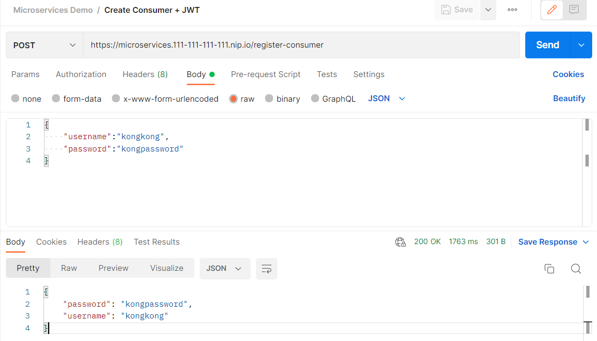
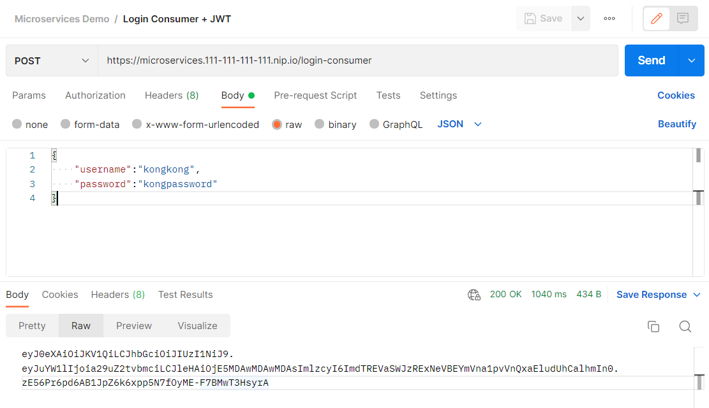
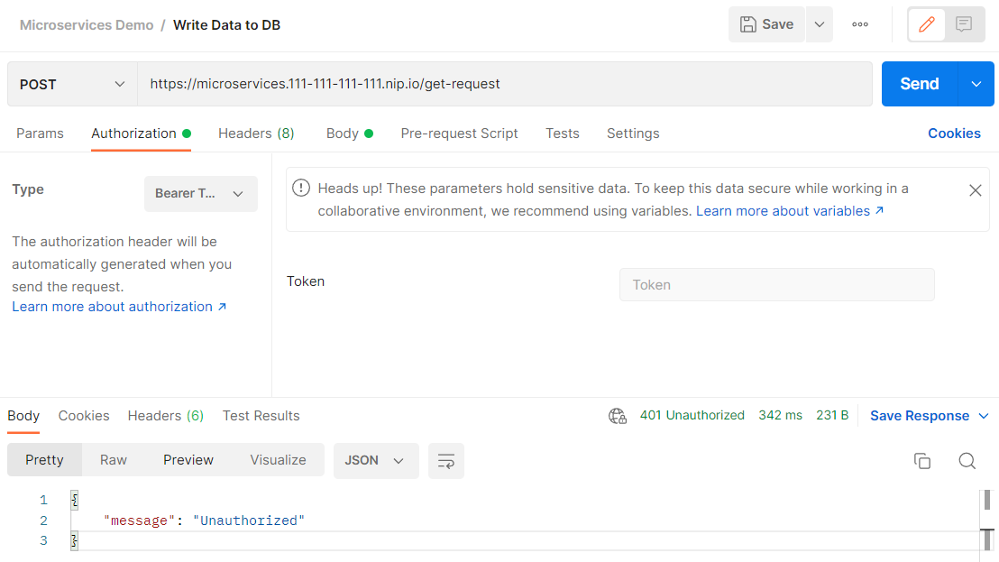
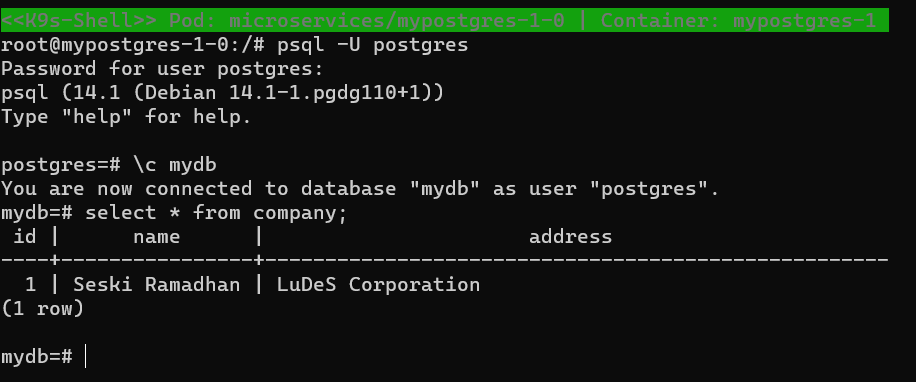

# Testing

### **Prequisites**

1. Import Microservices Demo.postman_collection.json to your Postman
2. Make sure you change ip address
   

### **How To**

1. Create new user (consumer)
   
   
2. Login and get jwt
   
3. Write to database to without bearer token
   
4. Write to database with bearer token
   
   
