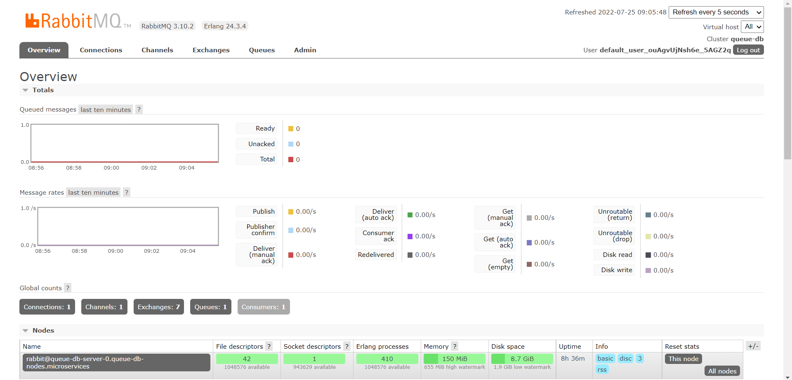

# **DEMO MICROSERVICES**

### **Tech Stack**

1. Kubernetes
2. Kong
3. Konga
4. Rabbit MQ

### **Diagram**

### **Deployment**

1. Please refer to this [Deployment](Kubernetes-Manifests/) folder

### **Postman Testing**

1. Please refer to this [Postman](Postman/) folder

### **Microservices**

1. [Register Consumer](Register-Consumer/). Register consumers to Kong DB
2. [Login Consumer](Login-Consumer/). Get secret + key from Kong Admin, craft jwt, and send back to client
3. [Get Request](Get-Request/). Receive request from client and publish to RabbitMQ
4. [Write Database](Write-Database/). Subscribe new message from RabbitMQ and write to DB

### **Screenshot**

1. Konga to Kong configuration
   > 
2. Kong ingress controller manage by Konga
   
3. RabbitMQ dashboard
   
4. K9S port forward
   
